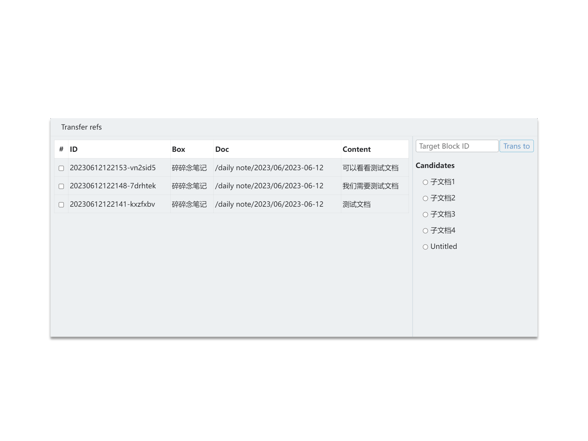

# Transfer the ref links

This feature is similar to the official "Transfer Reference Link", but with more refined operations. You can select the desired reference source for transfer, rather than transferring all references indiscriminately.

##  Usage

- Click the icon button on the document block or content block to activate the transfer panel in the plugin icon.
- In the panel, the left column lists all the references of the block, and the right column is the target block for reference transfer.
- Click the checkboxes in the table to select which references need to be transferred.
- Fill in the target block ID, or select a candidate option below (they are all sub-documents of the current block).
- Click the "Transfer" button.

